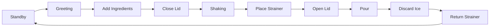
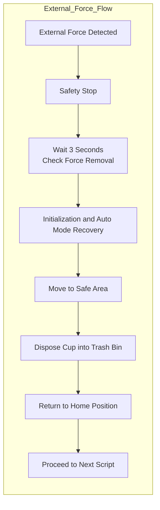
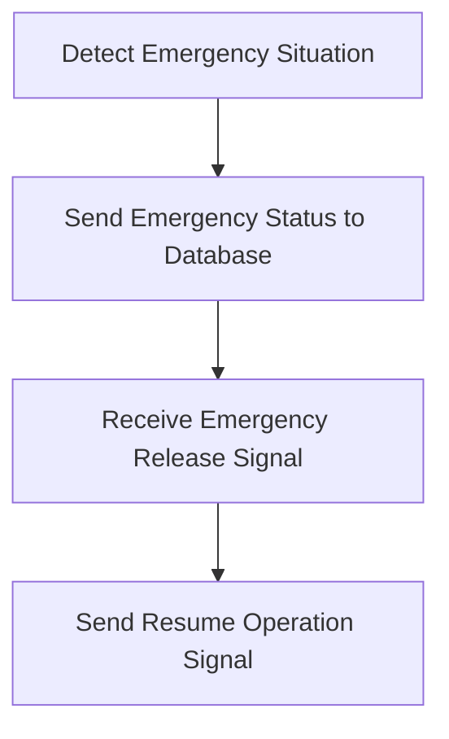
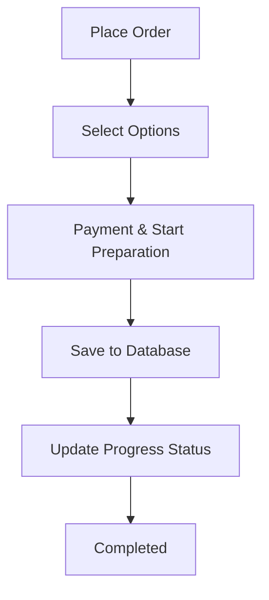

# ADC Cocktail-Robot


## Overview
This project is a ROS2-based collaborative Cocktail-Robot system with M0609 model from Doosan Robotics.  
It is designed to control robotic tasks integrated with external systems such as Firebase DB and user interfaces.
you can download it with git as well as docker

full video : https://youtu.be/z9A9UtmMI2A?si=LMfx_Y0nX4l919ae

# 🐳 Docker
https://hub.docker.com/r/jongun1203/bartender_cobot_image

```
docker run -it \
    --net=host \
    --privileged \
    -e DISPLAY=$DISPLAY \
    -v /tmp/.X11-unix:/tmp/.X11-unix \
    -v /path/to/your/serviceAccountKey.json:/home/kim/cobot_ws/serviceAccountKey.json \
    --name bartender_cobot \
    jongun1203/bartender_cobot_image:v1.0
```


# 🔧 Git Setup
---

## ⚙️ Requirements

Make sure your environment meets the following:

- Ubuntu 22.04 (recommended)
- ROS2 (Humble or compatible)
- Python 3.8+
- personal Firebase DB API-Key file(we provide DB Format)
- Doosan-robot2 library(preferable, still available to simulate it in virtual environment without it)
---

## 🚀 Installation

### 1. Clone the Repository
```bash
cd ~/cobot_ws/src
git clone https://github.com/DongSearch/Rokey-Cobot-Proj1.git
```
### 2. Install Dependencies
```
cd ~/cobot_ws
rosdep update
rosdep install --from-paths src --ignore-src -r -y
```
### 3. download doosn-robot2 library
https://github.com/DoosanRobotics/doosan-robot2/tree/humble

### 4. Build
```
colcon build
```
### 5. Source the environment
```
source install/setup.bash
```
### 6. create firebase apk-key json file and put it in your path

### 7. design firebase DB like excel file provided


### 8. Run launch file
```
ros2 launch cobot1 start.launch.py
```


## Flowchart

### Robot Workflow



### Exception1


### Exception2


### order(WEB)


